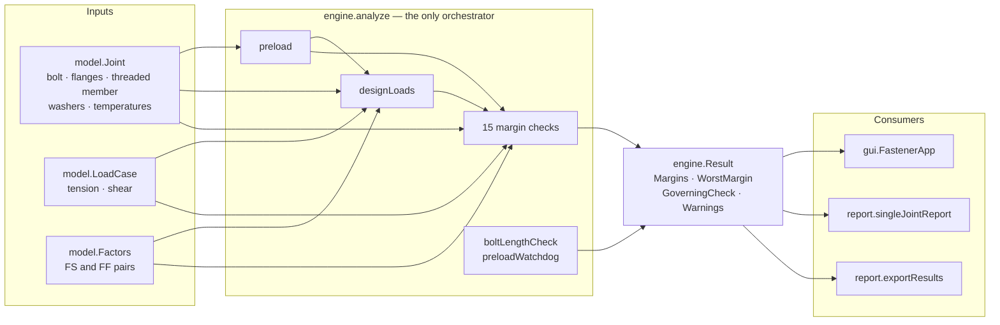
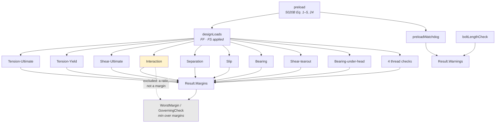
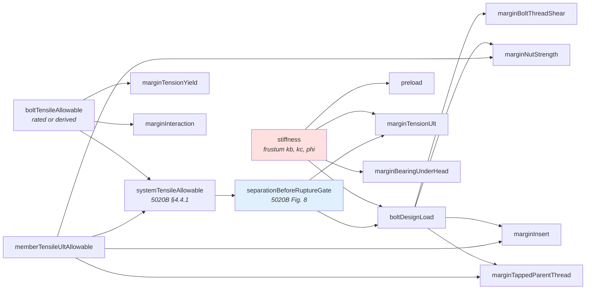
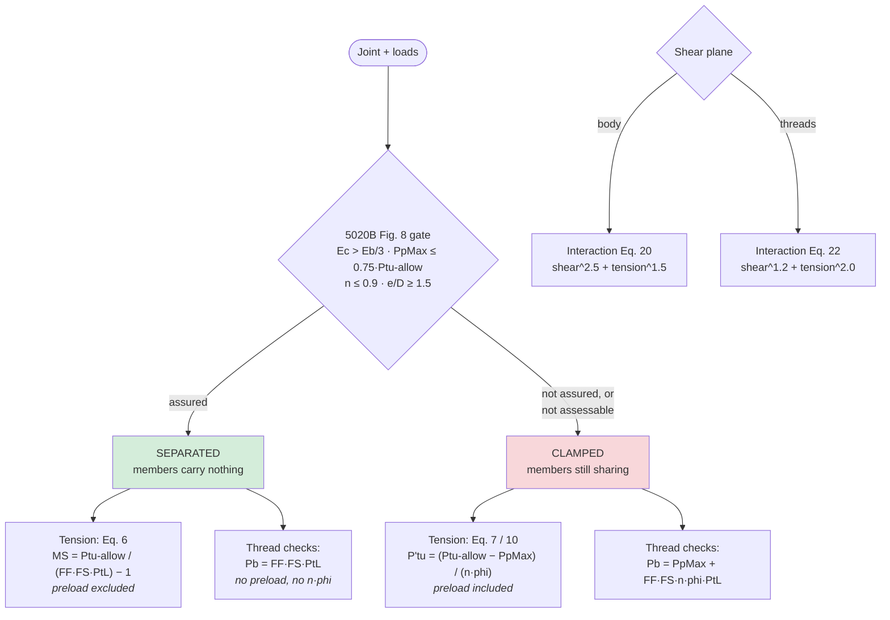
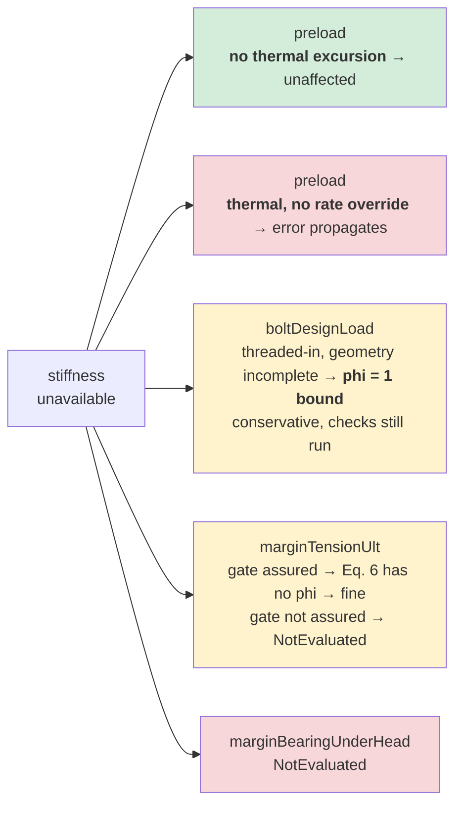
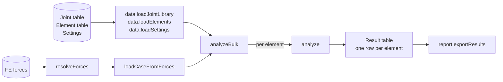

# Engine Flow

> How the analysis engine works, as diagrams. Generated from source — regenerate
> rather than hand-editing, or it drifts.
>
> `ARCHITECTURE.md` §3 has the same information as text plus the package map;
> this file is the picture. Mermaid renders natively on GitHub.

---

## 1. The whole path, input to output

Nothing calls back into `analyze`. Every consumer reads a finished `Result`; none
of them computes.

---

## 2. Inside `analyze` — actual call order

**Interaction is deliberately outside the worst-margin minimum.** It reports a
ratio `R` passing at `R ≤ 1`, which is not comparable to a margin passing at
`MS ≥ 0`. It keeps its own row and status, so a failing interaction still fails
the joint — it just cannot govern.

---

## 3. Shared primitives — why they exist

Each shared helper exists so its callers **cannot disagree**. One evaluation of
the Figure 8 gate feeds both the tension margin and the thread design load, so
those five rows can never contradict each other about whether the joint
separates. One allowable resolver feeds the yield margin, the interaction check
and the system minimum.

`stiffness` (red) has the deepest reach — see §5.

---

## 4. The two decisions that change which equation runs

The gate is evaluated **once** and shared. The `0.75–0.85 · Ptu-allow` band is
treated as not-assured, because confirming separation there needs bolt-elongation
ductility data the tool does not have — the conservative reading.

---

## 5. Where a missing input costs you

Not every dependency is fatal. This is what actually happens when something
cannot be computed — the distinction a call graph alone cannot show.

`stiffness` no longer refuses any CONFIGURATION outright. Insert and
tapped-hole joints compute via the shortened grip `L = t1 + D/2`; a
mixed-modulus flange stack computes via the thickness-weighted harmonic-mean
member modulus `Ebar` (NASA TM-106943 Eq. 34 — see `STIFFNESS_PLAN.md` §3 and
`TOOL_DIFFERENCES.md` §7.5 for the approximation's measured error bound).
`stiffness` still errors on missing DATA (e.g. no `HeadBearingDiameter`, no
`BodyLengthInGrip`/fallback inputs, an empty `FlangeStack`); a joint reaches
the diagram above only then. Green means unaffected, amber means conservative
fallback, red means the row reports not-evaluated. Only the amber and red paths
lose anything, and only one of them loses the whole analysis.

---

## 6. Bulk

`runBulk` and `runWorkbook` wrap this as one call. Every row goes through the
same `analyze` a single joint does — there is no separate bulk math.

---

## Regenerating

The call edges come from parsing `matlab/+engine/*.m` for `engine.*` references
with comments stripped, and the ordering from the sequence of calls inside
`analyze`. Re-derive both from source when the engine changes; a diagram that
disagrees with the code is worse than none.
